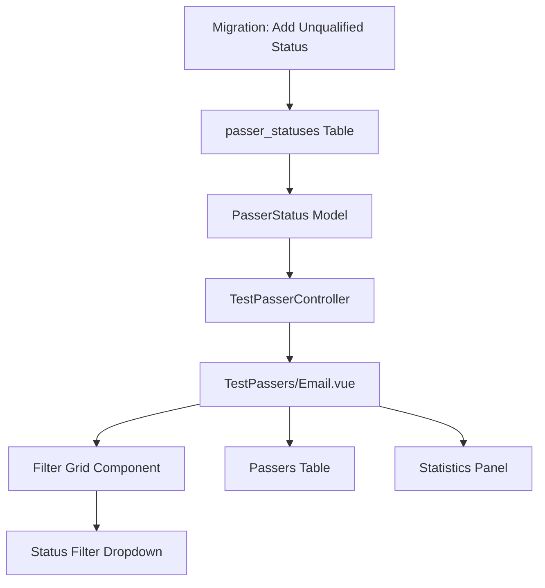

# Design Document

## Overview

This design document outlines the technical implementation for adding a status filter dropdown to the List Passer page in the PUPTAS admin panel. The feature will allow administrators to filter PUPCET test passers by their qualification status (Qualified, Waitlisted, Unqualified) alongside existing filters for school year, batch number, and search terms.

The implementation involves three main components:
1. **Database Enhancement**: Adding an "Unqualified" status to the existing `passer_statuses` table
2. **Frontend UI Enhancement**: Adding a status filter dropdown to the existing filter grid in `TestPassers/Email.vue`
3. **Filtering Logic Enhancement**: Extending the existing computed property `filteredPassers` to include status-based filtering

The design leverages the existing Laravel + Vue.js + Inertia.js architecture and follows established patterns in the codebase for consistency and maintainability.

## Architecture

### System Context

The List Passer page (`TestPassers/Email.vue`) is part of the PUPTAS admin panel that allows administrators to:
- View and filter PUPCET test passers
- Send personalized emails to selected passers
- Manage passer data and statuses

The page currently supports filtering by:
- Search term (name, surname, email)
- School year
- Batch number
- Sorting by various fields

### Component Architecture



### Data Flow

1. **Initial Load**: `TestPasserController.index()` fetches all test passers with their associated `passerStatus` relationship
2. **Frontend Processing**: Vue component receives grouped passers and flattens them for filtering
3. **Filtering**: `filteredPassers` computed property applies all active filters including the new status filter
4. **Display**: Filtered results are paginated and displayed in the table with updated statistics

## Components and Interfaces

### Database Layer

#### Migration: Add Unqualified Status
- **File**: `database/migrations/YYYY_MM_DD_HHMMSS_add_unqualified_passer_status.php`
- **Purpose**: Adds the "unqualified" status to the `passer_statuses` table
- **Implementation**: Inserts new record with `id=3` and `status='unqualified'`

```php
// Migration up() method
DB::table('passer_statuses')->insertOrIgnore([
    ['id' => 3, 'status' => 'unqualified', 'created_at' => now(), 'updated_at' => now()]
]);
```

#### Model Layer
- **PasserStatus Model**: No changes required (already exists)
- **TestPasser Model**: No changes required (relationship already established)

### Backend Layer

#### TestPasserController
- **Method**: `index()`
- **Current Behavior**: Fetches all test passers with `passerStatus` relationship
- **Required Changes**: None (already includes necessary data)

The controller already loads the `passerStatus` relationship:
```php
$passers = TestPasser::with('passerStatus')->orderByRaw('pupcet_total_score DESC')
```

### Frontend Layer

#### TestPassers/Email.vue Component

**New Reactive Data Properties:**
```javascript
const filterPasserStatus = ref(""); // New status filter state
```

**Enhanced Filter Grid:**
The existing filter grid will be extended with a new status filter dropdown positioned alongside existing filters.

**Updated Computed Properties:**
- `filteredPassers`: Enhanced to include status filtering logic
- Statistics counters: Will automatically reflect filtered results

#### Status Filter Dropdown Component
- **Location**: Within existing "Filter Grid" section
- **Styling**: Consistent with existing dropdowns (rounded-xl, border, focus ring)
- **Options**: "All Statuses" (default), "Qualified", "Waitlisted", "Unqualified"

## Data Models

### Existing Data Structure

#### passer_statuses Table
```sql
CREATE TABLE passer_statuses (
    id BIGINT UNSIGNED PRIMARY KEY,
    status VARCHAR(255) UNIQUE NOT NULL,
    created_at TIMESTAMP,
    updated_at TIMESTAMP
);

-- Current records:
-- id=1, status='qualified'
-- id=2, status='waitlisted'
-- New record to be added:
-- id=3, status='unqualified'
```

#### test_passers Table (Relevant Fields)
```sql
-- Existing foreign key relationship
passer_status_id BIGINT UNSIGNED NULLABLE,
FOREIGN KEY (passer_status_id) REFERENCES passer_statuses(id)
```

### Frontend Data Structure

#### Passer Object Structure
```javascript
{
  test_passer_id: number,
  surname: string,
  first_name: string,
  email: string,
  passer_status_id: number | null, // 1=qualified, 2=waitlisted, 3=unqualified
  school_year: string,
  batch_number: string,
  pupcet_total_score: number | null,
  // ... other fields
}
```

#### Filter State
```javascript
{
  searchTerm: string,
  filterSchoolYear: string,
  filterBatchNumber: string,
  filterPasserStatus: string, // New: "", "1", "2", "3"
  sortKey: string,
  sortOrder: string
}
```

## Correctness Properties

*A property is a characteristic or behavior that should hold true across all valid executions of a system-essentially, a formal statement about what the system should do. Properties serve as the bridge between human-readable specifications and machine-verifiable correctness guarantees.*

Based on the prework analysis, the following properties capture the universal behaviors that should hold across all valid inputs and system states:

### Property Reflection

After analyzing all acceptance criteria, I identified several areas where properties can be consolidated:
- Properties 3.1, 3.2, 3.3 (individual status filtering) can be combined into a single comprehensive status filtering property
- Properties 2.5, 2.6, 3.4 (status filtering behaviors) are redundant with the consolidated status filtering property
- Properties 5.1, 5.2, 5.3 (counter updates) can be combined into a comprehensive counter consistency property
- Properties 4.2, 4.3 (pagination text) can be combined into a single pagination calculation property

### Property 1: Status Filtering Correctness

*For any* dataset of test passers and any selected status filter value (qualified=1, waitlisted=2, unqualified=3, or "All Statuses"), the filtered results SHALL contain only passers whose `passer_status_id` matches the selected value, or all passers when "All Statuses" is selected.

**Validates: Requirements 2.5, 2.6, 3.1, 3.2, 3.3, 3.4**

### Property 2: Combined Filter Logic

*For any* combination of active filters (search term, school year, batch number, and status), the filtered results SHALL contain only passers that satisfy ALL active filter conditions using AND logic.

**Validates: Requirements 3.6**

### Property 3: Empty Result Handling

*For any* combination of filter values that produces zero matching passers, the system SHALL display an empty table with appropriate messaging and "Showing 0 to 0 of 0 results" pagination text.

**Validates: Requirements 3.7, 4.3**

### Property 4: Pagination Reset on Filter Change

*For any* current page number and any status filter change, the system SHALL reset the current page to 1 and update pagination accordingly.

**Validates: Requirements 4.1, 4.2**

### Property 5: Counter Consistency

*For any* active filter combination, all counter displays (passers badge, statistics panel "Filtered" metric) SHALL show the same count that matches the actual number of filtered results.

**Validates: Requirements 5.1, 5.2, 5.3**

### Property 6: Reactive UI Updates

*For any* status filter change, all dependent UI elements (counters, pagination text, table contents) SHALL update immediately without requiring a page reload.

**Validates: Requirements 5.4**

<function_calls>
<invoke name="prework">
<parameter name="featureName">list-passer-status-filter

## Error Handling

### Database Migration Errors
- **Duplicate Record Error**: The migration uses `insertOrIgnore()` to prevent errors if the "unqualified" status already exists
- **Foreign Key Constraint**: Existing foreign key constraints ensure data integrity
- **Rollback Safety**: The down() method only removes the specific "unqualified" record to prevent data loss

### Frontend Error Handling
- **Invalid Status Values**: The dropdown only allows predefined values, preventing invalid selections
- **Empty Result Sets**: The UI gracefully handles empty filter results with appropriate messaging
- **Network Errors**: Existing error handling in the parent component covers data loading failures

### Data Consistency
- **Null Status Values**: Passers with `passer_status_id = null` are handled as "Pending" in the UI
- **Missing Relationships**: The existing `with('passerStatus')` eager loading prevents N+1 queries
- **Filter State Persistence**: Filter changes reset pagination to prevent invalid page states

## Testing Strategy

### Dual Testing Approach

This feature requires both **unit tests** for specific behaviors and **property-based tests** for comprehensive coverage of the filtering logic.

#### Unit Tests
Unit tests will focus on:
- **Database Migration**: Verify migration creates the unqualified status record correctly
- **UI Rendering**: Verify dropdown appears with correct options and styling
- **Initial State**: Verify default selection and initial display state
- **Edge Cases**: Empty result sets, null status values, migration idempotency

#### Property-Based Tests
Property-based tests will verify universal behaviors using **Jest** with **fast-check** library:
- **Minimum 100 iterations** per property test
- Each test tagged with: **Feature: list-passer-status-filter, Property {number}: {property_text}**

**Property Test Configuration:**
```javascript
// Example property test structure
describe('Status Filtering Properties', () => {
  test('Property 1: Status filtering correctness', () => {
    fc.assert(fc.property(
      fc.array(passerGenerator), // Generate random passer datasets
      fc.oneof(fc.constant(''), fc.constant('1'), fc.constant('2'), fc.constant('3')), // Status values
      (passers, statusFilter) => {
        const filtered = applyStatusFilter(passers, statusFilter);
        // Verify filtering correctness
        return verifyStatusFilterResults(filtered, statusFilter);
      }
    ), { numRuns: 100 });
  });
});
```

#### Integration Tests
- **End-to-End**: Verify complete user workflow from page load to filtered results
- **Database Integration**: Verify migration runs successfully in test environment
- **Component Integration**: Verify filter interactions with existing components

#### Test Data Generation
Property tests will use generators for:
- **Passer Objects**: Random combinations of names, emails, scores, and status IDs
- **Filter Combinations**: Random combinations of search terms, years, batches, and statuses
- **Page States**: Random current page numbers for pagination testing

### Test Coverage Requirements
- **Unit Test Coverage**: 100% of new code paths
- **Property Test Coverage**: All 6 correctness properties implemented
- **Integration Coverage**: Complete user workflows and database operations
- **Edge Case Coverage**: Empty results, null values, boundary conditions

### Performance Testing
- **Filter Performance**: Verify filtering remains responsive with large datasets (1000+ passers)
- **Pagination Performance**: Verify pagination calculations remain efficient
- **Memory Usage**: Verify no memory leaks in reactive filter updates

The testing strategy ensures both correctness (through property-based testing) and reliability (through comprehensive unit and integration testing) while maintaining the existing code quality standards.