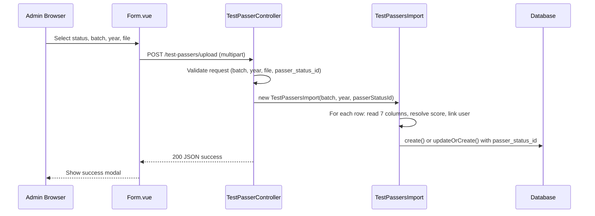

# Design Document: Upload Passer Status

## Overview

This feature modifies the existing Upload Passers workflow to simplify the Excel import process and add a bulk status assignment capability. The changes affect three layers of the application:

1. **Frontend (Vue 3)**: Add a status dropdown to the upload form that requires the admin to select a passer status (qualified/waitlisted/unqualified) before uploading.
2. **Backend Controller (Laravel)**: Validate the new `passer_status_id` field in the upload request and pass it to the import class.
3. **Import Class (Laravel Excel)**: Reduce the processed columns from 12+ to 7 permitted columns, remove legacy field handling (date parsing, multi-variant score resolution), and apply the request-level status uniformly to all imported records.

The design preserves backward compatibility for non-removed functionality: batch/school year selection, user linking via email, applicant profile updates, and the create/updateOrCreate branching logic.

## Architecture

The architecture remains a standard Laravel + Inertia.js request flow with no new services or infrastructure:



### Key Design Decisions

1. **Status from request, not from Excel**: The `passer_status_id` is passed as a constructor parameter to `TestPassersImport` and applied to every row. Any "status" column in the Excel file is ignored.
2. **Column reduction via code removal**: Rather than adding column filtering logic, we simply remove all references to the dropped columns from the import class. The `WithHeadingRow` concern means unrecognized columns are naturally ignored.
3. **Score resolution simplification**: Replace the multi-variant `resolveScore()` method with a direct read from the `pupcet_score` column only, with numeric validation and range checking.
4. **No migration needed**: The `test_passers` table already has all required columns. Removed fields remain in the schema (nullable) but are no longer populated during import.

## Components and Interfaces

### 1. Form.vue (Frontend Component)

**Path**: `resources/js/Pages/Uploads/Form.vue`

**Changes**:
- The status dropdown already exists in the current implementation with the correct options and positioning.
- Validation already prevents submission without a status selection (`if (!passerStatus.value) return alert(...)`).
- The `passer_status_id` is already appended to the FormData payload.

**No frontend changes are required** — the current Form.vue already implements Requirement 1 and Requirement 2 fully.

### 2. TestPasserController (Backend Controller)

**Path**: `app/Http/Controllers/TestPasserController.php`

**Changes to `upload()` method**:
- The validation rules already include `'passer_status_id' => 'required|integer|in:1,2,3'`.
- The controller already passes `$passerStatusId` to the `TestPassersImport` constructor.

**No controller changes are required** — the current implementation already satisfies Requirements 2 and 7.1.

### 3. TestPassersImport (Import Class)

**Path**: `app/Imports/TestPassersImport.php`

**This is the primary component requiring changes.**

**Interface** (unchanged constructor signature):
```php
class TestPassersImport implements ToModel, WithHeadingRow
{
    public function __construct(
        string $batch,
        string $schoolYear,
        int $passerStatusId
    )
}
```

**Changes**:
- Remove `use PhpOffice\PhpSpreadsheet\Shared\Date as ExcelDate;` import
- Remove the `resolveScore()` private method
- Remove all references to: `date_of_birth`, `address`, `school_address`, `school`/`shs_school`, `year_graduated`
- Remove date parsing logic (Excel serial date conversion)
- Read `pupcet_score` column directly with numeric validation and range check (0.00–9999.99)
- Read `middle_name` column (currently reads `middlename` — needs to match the permitted column name)
- Apply `$this->passerStatusId` to every record (already done)

**Revised `model()` method column reads**:
| Excel Column | Model Field | Notes |
|---|---|---|
| `surname` | `surname` | Direct mapping |
| `firstname` | `first_name` | Trimmed, skip row if empty |
| `middle_name` | `middle_name` | Direct mapping |
| `strand` | `strand` | Direct mapping |
| `email` | `email` | Used for user linking and updateOrCreate key |
| `reference_number` | `reference_number` | Direct mapping |
| `pupcet_score` | `pupcet_total_score` | Numeric validation, range 0–9999.99, null otherwise |

### 4. Score Resolution Logic

Replace the multi-variant `resolveScore()` with inline logic:

```php
private function resolvePupcetScore(array $row): ?float
{
    $value = $row['pupcet_score'] ?? null;

    if ($value === null || trim((string) $value) === '') {
        return null;
    }

    if (!is_numeric($value)) {
        return null;
    }

    $score = round((float) $value, 2);

    if ($score < 0.00 || $score > 9999.99) {
        return null;
    }

    return $score;
}
```

## Data Models

### TestPasser (existing, no schema changes)

| Field | Type | Source | Notes |
|---|---|---|---|
| `test_passer_id` | bigint PK | auto | Primary key |
| `surname` | varchar(255) | Excel: `surname` | |
| `first_name` | varchar(255) | Excel: `firstname` | Required, skip row if empty |
| `middle_name` | varchar(255) | Excel: `middle_name` | Nullable |
| `date_of_birth` | date | **NOT SET** | Remains in schema, not populated by import |
| `address` | varchar(255) | **NOT SET** | Remains in schema, not populated by import |
| `school_address` | varchar(255) | **NOT SET** | Remains in schema, not populated by import |
| `shs_school` | varchar(255) | **NOT SET** | Remains in schema, not populated by import |
| `strand` | varchar(255) | Excel: `strand` | |
| `year_graduated` | int | **NOT SET** | Remains in schema, not populated by import |
| `email` | varchar(255) | Excel: `email` | Used as unique key for updateOrCreate |
| `reference_number` | varchar(255) | Excel: `reference_number` | |
| `batch_number` | varchar(255) | Request | From form |
| `school_year` | varchar(255) | Request | From form |
| `pupcet_total_score` | float | Excel: `pupcet_score` | Validated numeric, range 0–9999.99 |
| `user_id` | bigint FK | Derived | Linked if email matches User |
| `status` | string | Derived | "registered" if user found, else "pending" |
| `passer_status_id` | int FK | Request | From status dropdown (1, 2, or 3) |

### PasserStatus (existing, no changes)

| id | status |
|---|---|
| 1 | qualified |
| 2 | waitlisted |
| 3 | unqualified |

### Request Payload Schema

```
POST /test-passers/upload
Content-Type: multipart/form-data

Fields:
  batch_number: string (required)
  school_year: string (required)
  passer_status_id: integer (required, in: 1,2,3)
  file: file (required, mimes: xlsx,xls,csv)
```


## Correctness Properties

*A property is a characteristic or behavior that should hold true across all valid executions of a system — essentially, a formal statement about what the system should do. Properties serve as the bridge between human-readable specifications and machine-verifiable correctness guarantees.*

### Property 1: Bulk status application

*For any* set of Excel rows (with valid firstname values) and *for any* valid `passer_status_id` (1, 2, or 3), every TestPasser record created or updated during import SHALL have its `passer_status_id` field set to the request-level value, regardless of any "status" column present in the Excel data or any prior `passer_status_id` on existing records.

**Validates: Requirements 3.1, 3.2, 3.3**

### Property 2: Column mapping correctness

*For any* Excel row containing the 7 permitted columns (surname, firstname, middle_name, strand, email, reference_number, pupcet_score), the resulting TestPasser record SHALL have: `surname` equal to the row's `surname`, `first_name` equal to the row's `firstname`, `middle_name` equal to the row's `middle_name`, `strand` equal to the row's `strand`, `email` equal to the row's `email`, and `reference_number` equal to the row's `reference_number`. Any additional columns present in the Excel file SHALL not affect the created record's field values.

**Validates: Requirements 4.1, 4.2**

### Property 3: Removed fields exclusion

*For any* imported Excel row (regardless of what columns are present in the file), the resulting TestPasser record SHALL never have `date_of_birth`, `address`, `school_address`, `shs_school`, or `year_graduated` fields set by the import operation.

**Validates: Requirements 5.1, 5.2, 5.3, 5.4, 5.5**

### Property 4: Score validation and storage

*For any* value in the `pupcet_score` column: if the value is numeric and within the range [0.00, 9999.99], the `pupcet_total_score` field SHALL be set to `round(value, 2)`. For any value that is empty, whitespace-only, non-numeric, or outside the range [0.00, 9999.99], the `pupcet_total_score` field SHALL be set to null.

**Validates: Requirements 6.1, 6.2, 6.3, 6.4, 4.3, 4.4**

### Property 5: Empty firstname skips row

*For any* Excel row where the `firstname` column is null, empty string, or composed entirely of whitespace characters, the import SHALL not create or update any TestPasser record for that row.

**Validates: Requirements 4.6, 5.8, 7.6**

### Property 6: User linking by email

*For any* Excel row with a non-empty email value: if a User record with that email exists in the database, the resulting TestPasser record SHALL have `user_id` set to that User's id and `status` set to "registered". If no User record with that email exists, the resulting TestPasser record SHALL have `user_id` set to null and `status` set to "pending".

**Validates: Requirements 7.3, 7.5**

### Property 7: Persistence strategy by email presence

*For any* Excel row with a non-empty email value, importing that row multiple times SHALL result in exactly one TestPasser record for that email (updateOrCreate behavior). *For any* Excel row with no email value, each import SHALL create a new distinct TestPasser record (create behavior, no deduplication).

**Validates: Requirements 7.7, 7.8**

### Property 8: Controller validation rejects invalid passer_status_id

*For any* upload request where `passer_status_id` is not an integer in the set {1, 2, 3} (including null, missing, strings, floats, or out-of-range integers), the controller SHALL return a 422 validation error and SHALL not process the uploaded file.

**Validates: Requirements 2.2, 2.3, 3.4**

### Property 9: Applicant profile student_number update

*For any* Excel row where the email matches an existing User who has an `applicantProfile` and the row contains a non-empty `reference_number`, the import SHALL update that applicantProfile's `student_number` field to the row's `reference_number` value.

**Validates: Requirements 7.4**

## Error Handling

### Frontend Errors

| Scenario | Handling |
|---|---|
| No status selected | `alert("Please select a passer status.")` — form submission prevented |
| No file selected | `alert("Please select a file to upload.")` — form submission prevented |
| 403 response | Alert: "You do not have permission to upload passers." |
| 422 response | Alert with validation error details from `errors` object |
| Other errors | Generic alert with error message if available |

### Backend Validation Errors (422)

| Field | Rule | Error Message |
|---|---|---|
| `batch_number` | required, string | "The batch number field is required." |
| `school_year` | required, string | "The school year field is required." |
| `file` | required, file, mimes:xlsx,xls,csv | "The file must be a file of type: xlsx, xls, csv." |
| `passer_status_id` | required, integer, in:1,2,3 | "The selected passer status id is invalid." |

### Import Row-Level Handling

| Condition | Behavior |
|---|---|
| Empty/whitespace firstname | Row silently skipped (return null from model()) |
| Non-numeric pupcet_score | Store null for pupcet_total_score, continue import |
| Out-of-range pupcet_score | Store null for pupcet_total_score, continue import |
| Empty email | Create new record (no updateOrCreate) |
| Email not matching any User | Set user_id=null, status="pending" |
| Excel has extra columns | Ignored by WithHeadingRow (only mapped columns read) |

### No Partial Failure Handling

The current implementation uses `Maatwebsite\Excel` with `ToModel` concern, which processes rows individually. If one row fails (e.g., database constraint violation), it does not roll back other rows. This is existing behavior and is not changed by this feature.

## Testing Strategy

### Property-Based Tests (PHPUnit + custom data providers)

Since Laravel/PHP does not have a widely-adopted PBT library equivalent to QuickCheck, property-based tests will be implemented using PHPUnit data providers with randomized inputs generated via helper functions. Each test will run a minimum of 100 iterations.

**Library**: PHPUnit with custom randomized data providers (using `Faker` for data generation)

**Configuration**: Each property test method will use a loop of 100 iterations with randomly generated inputs per iteration.

**Tag format**: Each test will include a docblock comment: `@property Feature: upload-passer-status, Property {N}: {title}`

| Property | Test Focus | Key Generators |
|---|---|---|
| 1: Bulk status application | All records get request-level status | Random rows × random valid status |
| 2: Column mapping | 7 columns map correctly | Random strings for each column |
| 3: Removed fields exclusion | 5 fields never set | Rows with extra columns populated |
| 4: Score validation | Numeric range → rounded, else null | Random floats, strings, edge values |
| 5: Empty firstname skips | No record created | Whitespace variants, null, empty |
| 6: User linking | user_id and status derived from email match | Random emails, some matching Users |
| 7: Persistence strategy | updateOrCreate vs create | Duplicate emails, empty emails |
| 8: Controller validation | Invalid status rejected | Random invalid values |
| 9: Profile update | student_number updated | Users with profiles, random ref numbers |

### Unit Tests (Example-Based)

| Test | Validates |
|---|---|
| Form renders status dropdown with correct options | Req 1.1 |
| Form prevents submission without status | Req 1.3, 1.4 |
| Form includes passer_status_id in payload | Req 2.1 |
| Controller rejects missing batch_number | Req 7.1 |
| Controller rejects invalid file type | Req 7.1 |
| Import ignores pupcet_total_score column name | Req 4.5, 6.5 |
| Import ignores total_score column name | Req 4.5, 6.5 |

### Integration Tests

| Test | Validates |
|---|---|
| Full upload flow: valid file with 3 rows, status=2 → all records have passer_status_id=2 | Req 1–3 end-to-end |
| Upload with matching user emails → user linking works | Req 7.3, 7.4 |
| Re-upload same file with different status → records updated | Req 3.3 |

### Test File Structure

```
tests/
  Feature/
    TestPasserUploadTest.php          # Integration tests for full upload flow
  Unit/
    TestPassersImportTest.php         # Property + unit tests for import logic
    TestPasserControllerValidationTest.php  # Controller validation tests
```
