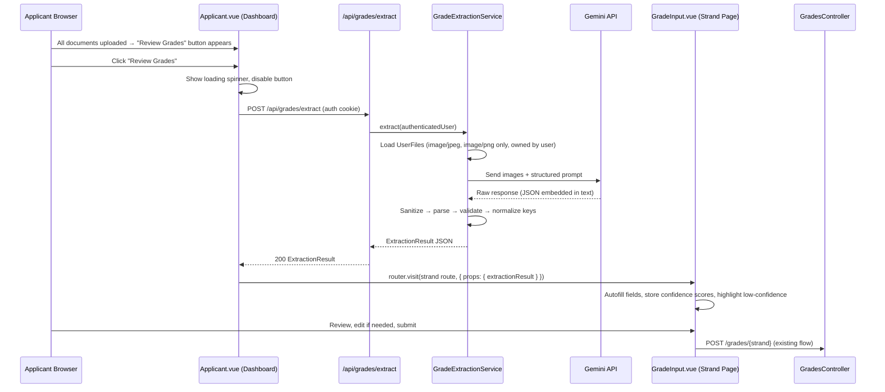

# Design Document: AI Grade Extraction

## Overview

This feature adds AI-powered grade extraction to the existing Laravel + Inertia.js (Vue) admissions system. Applicants who have uploaded all required documents will see a "Review Grades" button on their dashboard. Clicking it sends their uploaded images to the Gemini multimodal API server-side, which returns a structured JSON result containing subject grades and confidence scores. The Grade Input Page is then autofilled with those values, with low-confidence fields visually highlighted for applicant review before final submission.

The feature integrates with the existing document upload flow (`UserFile` model, `ConfirmationController`), the strand-specific Grade Input Pages (`ABMGradeInput.vue`, etc.), and the existing `GradesController` submission flow. No changes are made to the final grade submission logic.

## Architecture



### Key Design Decisions

- **Server-side Gemini calls only**: The `GEMINI_API_KEY` never leaves the server. The frontend only receives the parsed `ExtractionResult`.
- **Inertia page visit with props**: After successful extraction, the dashboard uses `router.visit()` with `data` props to pass the `ExtractionResult` to the Grade Input Page, avoiding a separate API call from the grade page.
- **No new database tables**: Raw Gemini responses are never persisted. The existing `Grade` model is only written on final submission via the existing `GradesController`.
- **Rate limiting via Laravel's built-in throttle**: A named rate limiter (`grade-extraction`) is registered in `AppServiceProvider` — 10 requests per applicant per hour.

## Components and Interfaces

### Backend

**`GradeExtractionController`** (`app/Http/Controllers/GradeExtractionController.php`)
- `POST /api/grades/extract` — authenticated, rate-limited
- Delegates to `GradeExtractionService`, returns `ExtractionResult` JSON or error response

**`GradeExtractionService`** (`app/Services/GradeExtractionService.php`)
- `extract(User $user): array` — main entry point
- `loadImages(User $user): array` — fetches `UserFile` records filtered to `image/jpeg` / `image/png`, verifies `user_id` ownership
- `buildPrompt(): string` — returns the structured Gemini prompt
- `callGemini(array $images, string $prompt): string` — HTTP call to Gemini REST API
- `sanitize(string $raw): string` — strips non-JSON surrounding content
- `parse(string $json): array` — JSON decode + structural validation
- `validate(array $data): void` — checks grade ∈ [0,100], confidence ∈ [0,1], throws on violation
- `normalizeKeys(array $data): array` — lowercases and trims all subject name keys

**`GeminiClient`** (`app/Services/GeminiClient.php`)
- Thin wrapper around Laravel's `Http` facade for the Gemini REST endpoint
- Reads `GEMINI_API_KEY` from `config('services.gemini.key')`
- Throws `GeminiApiException` on HTTP errors or connection failures

**Route** (added to `routes/api.php`):
```php
Route::middleware(['auth:sanctum', 'throttle:grade-extraction'])
    ->post('/grades/extract', [GradeExtractionController::class, 'extract']);
```

**Rate limiter** (registered in `AppServiceProvider::boot()`):
```php
RateLimiter::for('grade-extraction', function (Request $request) {
    return Limit::perHour(10)->by($request->user()?->id);
});
```

### Frontend

**`Dashboard/Applicant.vue`** (modified)
- New computed: `allDocumentsUploaded` — `true` when every value in `fileStatuses` has a non-null `url`
- New ref: `extracting` — controls loading state of the "Review Grades" button
- New ref: `extractionError` — holds error message string
- New method: `triggerExtraction()` — POSTs to `/api/grades/extract`, on success calls `router.visit()` to the strand-specific grade page with `extractionResult` as data prop
- "Review Grades" button: rendered only when `allDocumentsUploaded`, disabled when `extracting`

**`Pages/Grades/{Strand}GradeInput.vue`** (modified — all 6 strand pages)
- New prop: `extractionResult` (optional, `Object|null`, default `null`)
- New ref: `confidenceMap` — flat map of `{ [normalizedSubjectKey]: confidence }`
- New method: `applyAutofill(result)` — iterates `ExtractionResult`, matches keys case-insensitively to `form` fields, populates values, builds `confidenceMap`
- New computed per field (or helper function): `getConfidence(fieldKey)` — returns confidence from `confidenceMap` or `null`
- New computed: `isLowConfidence(fieldKey)` — `getConfidence(fieldKey) !== null && getConfidence(fieldKey) < 0.80`
- `onMounted`: if `extractionResult` prop is present, call `applyAutofill()`
- Dismissible banner: shown when `extractionResult` is non-null, hidden via `bannerDismissed` ref

**Confidence highlighting** (applied to each grade input):
```html
<input
  :class="[
    'w-full px-4 py-2 border rounded-lg ...',
    isLowConfidence(key) ? 'border-red-500 focus:ring-red-500' : 'border-gray-300 focus:ring-[#9E122C]'
  ]"
  ...
/>
<p v-if="isLowConfidence(key)" class="text-xs text-red-500 mt-1">
  <i class="fas fa-exclamation-triangle mr-1"></i>
  Low confidence result. Please verify.
</p>
<span v-if="getConfidence(key) !== null" class="text-xs text-gray-500 mt-1 block">
  AI confidence: {{ Math.round(getConfidence(key) * 100) }}%
</span>
```

## Data Models

### ExtractionResult (JSON response shape)

```typescript
type SubjectEntry = {
  grade: number;       // integer, 0–100
  confidence: number;  // float, 0.0–1.0
};

type SubjectGroup = {
  [subjectName: string]: SubjectEntry;  // keys are lowercase trimmed
};

type ExtractionResult = {
  math: SubjectGroup;
  science: SubjectGroup;
  english: SubjectGroup;
  others: SubjectGroup;
};
```

Example:
```json
{
  "math": {
    "general mathematics": { "grade": 90, "confidence": 0.95 },
    "business mathematics": { "grade": 88, "confidence": 0.60 }
  },
  "science": {
    "earth and life science": { "grade": 91, "confidence": 0.92 }
  },
  "english": {
    "oral communication": { "grade": 92, "confidence": 0.97 }
  },
  "others": {
    "araling panlipunan": { "grade": 90, "confidence": 0.55 }
  }
}
```

### Existing Models (unchanged)

- **`UserFile`**: `user_id`, `type`, `file_path`, `original_name`, `status` — used to load images for extraction
- **`Grade`**: `user_id`, `mathematics`, `english`, `science`, `g12_first_sem`, `g12_second_sem` — written only on final form submission via existing `GradesController`

### Configuration

`.env` addition:
```
GEMINI_API_KEY=your_key_here
```

`config/services.php` addition:
```php
'gemini' => [
    'key' => env('GEMINI_API_KEY'),
    'endpoint' => env('GEMINI_ENDPOINT', 'https://generativelanguage.googleapis.com/v1beta/models/gemini-1.5-flash:generateContent'),
],
```

## Correctness Properties

*A property is a characteristic or behavior that should hold true across all valid executions of a system — essentially, a formal statement about what the system should do. Properties serve as the bridge between human-readable specifications and machine-verifiable correctness guarantees.*

### Property 1: Review Grades button visibility is determined by document completeness

*For any* `fileStatuses` object, the "Review Grades" button SHALL be rendered if and only if every slot in `fileStatuses` has a non-null `url`. Equivalently, the presence of any null `url` slot SHALL cause the button to be absent.

**Validates: Requirements 1.1, 1.2**

### Property 2: File ownership filter

*For any* authenticated user and any collection of `UserFile` records in the database, `GradeExtractionService::loadImages()` SHALL return only files whose `user_id` equals the authenticated user's ID.

**Validates: Requirements 2.2, 9.3**

### Property 3: MIME type filter

*For any* collection of `UserFile` records associated with a user, `GradeExtractionService::loadImages()` SHALL return only files whose MIME type is `image/jpeg` or `image/png`, excluding all other types.

**Validates: Requirements 2.3, 2.4**

### Property 4: Extraction_Result structural validation

*For any* JSON string, `GradeExtractionService::parse()` SHALL accept it if and only if it is valid JSON containing exactly the four top-level keys (`math`, `science`, `english`, `others`), each mapping to an object of subject entries with `grade` (integer) and `confidence` (float) fields.

**Validates: Requirements 3.2, 3.4**

### Property 5: Grade and confidence range validation

*For any* `ExtractionResult`, `GradeExtractionService::validate()` SHALL reject the result (throw an exception) if any `grade` value is outside [0, 100] or any `confidence` value is outside [0.0, 1.0], and SHALL accept the result otherwise.

**Validates: Requirements 3.5**

### Property 6: Subject key normalization

*For any* subject name string, `GradeExtractionService::normalizeKeys()` SHALL produce a key that is equal to the original string lowercased and with leading/trailing whitespace removed.

**Validates: Requirements 3.3**

### Property 7: Response sanitization extracts JSON

*For any* string containing a valid JSON object surrounded by arbitrary non-JSON text (such as markdown code fences or prose), `GradeExtractionService::sanitize()` SHALL return a string that, when parsed, produces the same JSON object.

**Validates: Requirements 9.1**

### Property 8: Autofill field matching is case-insensitive and whitespace-tolerant

*For any* `ExtractionResult` and any grade input form, `applyAutofill()` SHALL populate a form field if and only if the field's normalized key (lowercase, trimmed) matches a subject key in the `ExtractionResult` using the same normalization. Unmatched fields SHALL remain unchanged.

**Validates: Requirements 4.1, 4.2, 4.3**

### Property 9: Confidence highlighting threshold

*For any* autofilled field with a confidence score, the field SHALL have a red border style and display the helper text "Low confidence result. Please verify." if and only if the confidence score is strictly less than 0.80. Fields with confidence ≥ 0.80 SHALL have no warning styles.

**Validates: Requirements 5.1, 5.2, 5.4**

### Property 10: Confidence percentage display

*For any* autofilled field with confidence score `c`, the displayed confidence label SHALL show `Math.round(c * 100)` followed by `%`.

**Validates: Requirements 5.3, 6.4**

### Property 11: All fields remain editable after autofill

*For any* `ExtractionResult` applied via `applyAutofill()`, no grade input field in the form SHALL have a `disabled` or `readonly` attribute set as a result of the autofill operation.

**Validates: Requirements 6.1, 6.2, 6.5**

### Property 12: Grade submission validation range

*For any* numeric value submitted to `GradesController`, the controller SHALL accept the value if it is in [0, 100] and reject it with a validation error otherwise.

**Validates: Requirements 9.2**

## Error Handling

| Scenario | HTTP Status | Behavior |
|---|---|---|
| Gemini API unreachable / connection error | 503 | Log error via `Log::error()`, return user-friendly message |
| Gemini returns HTTP 4xx/5xx | 503 | Log error, return user-friendly message |
| Gemini response is unparseable JSON | 422 | Return descriptive error, no partial data stored |
| Gemini response fails structural validation | 422 | Return descriptive error, no partial data stored |
| Grade or confidence value out of range | 422 | Return descriptive error, no partial data stored |
| Rate limit exceeded (>10/hour) | 429 | Return "Too many extraction requests. Please try again later." |
| User has no image files | 422 | Return "No valid image files found for extraction." |
| Unauthenticated request | 401 | Laravel Sanctum default |

Frontend error handling in `Applicant.vue`:
- On any non-2xx response: set `extractionError` ref, re-enable button, display error banner
- Error banner is dismissible and styled consistently with existing error patterns

## Testing Strategy

### Unit Tests (Pest PHP)

Test `GradeExtractionService` in isolation with mocked `GeminiClient`:

- `sanitize()`: various raw strings with JSON embedded in markdown fences, prose, or mixed content
- `parse()`: valid and invalid JSON structures
- `validate()`: boundary values (0, 100, 0.0, 1.0, -1, 101, -0.01, 1.01)
- `normalizeKeys()`: mixed-case strings, strings with leading/trailing spaces, unicode
- `loadImages()`: mixed MIME type collections, cross-user file sets

Test `GradeExtractionController`:
- Rate limit enforcement (mock `RateLimiter`)
- Auth guard (unauthenticated request returns 401)
- Gemini error propagation (503 response)

### Property-Based Tests (Pest + `edalzell/pest-plugin-arch` or raw Pest data providers)

Since the project uses Pest PHP (see `composer.json`), property-based tests will be implemented using Pest's `dataset` feature with generated inputs (100+ cases per property). For true PBT, the `giorgiopogliani/pest-faker` or manual data generation approach is used.

Each property test is tagged with a comment referencing the design property:
```php
// Feature: ai-grade-extraction, Property 5: Grade and confidence range validation
it('rejects out-of-range grade values', function (int $grade) {
    // ...
})->with(fn() => array_merge(
    array_map(fn($v) => [$v], range(-100, -1)),       // below 0
    array_map(fn($v) => [$v], range(101, 200)),        // above 100
));
```

Minimum 100 iterations per property test.

### Vue Component Tests (Vitest + Vue Test Utils)

Test `Applicant.vue`:
- `allDocumentsUploaded` computed with various `fileStatuses` shapes
- Button visibility toggling
- Loading state on click
- Error display on failed request

Test `{Strand}GradeInput.vue`:
- `applyAutofill()` with various `ExtractionResult` shapes
- Confidence highlighting class application
- Field editability after autofill
- Dismissible banner presence

### Integration Tests

- Full extraction flow with a real (or stubbed) Gemini response fixture
- Rate limiting: 11 sequential requests from the same user, assert 11th is 429
- File ownership: request extraction as user A with user B's files, assert 0 files processed

### Testing Approach Note

PBT is appropriate here because:
- `sanitize()`, `parse()`, `validate()`, `normalizeKeys()` are pure functions with large input spaces
- `loadImages()` filtering logic benefits from varied file collections
- Frontend autofill matching logic has a large space of possible key strings
- 100 iterations will surface edge cases (unicode, empty strings, boundary values) that example tests miss
