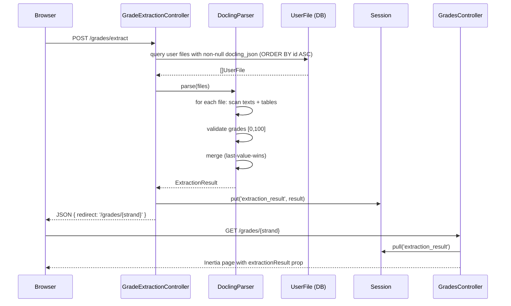

# Design Document: Docling Grade Autofill

## Overview

This feature replaces the existing AI-based grade extraction pipeline (Gemini + OpenRouter) with a deterministic, cost-free Docling-only pipeline. The new `DoclingParser` service reads pre-stored `docling_json` blobs from `UserFile` records, scans their `texts` and `tables` arrays for subject-grade pairs using a static `Subject_Mapping`, validates each grade value, and returns a normalized `ExtractionResult`. The `GradeExtractionController` is updated to delegate to `DoclingParser` instead of `GradeExtractionService`.

No LLM calls are made at any point. The pipeline is fully deterministic: given the same `docling_json` inputs, it always produces the same output.

### Key Research Findings

- The `docling_raw.json` sample confirms the Docling `DoclingDocument` schema v1.10.0. Text content lives in `json_content.texts[*].text` (with `orig` as a fallback). Tables live in `json_content.tables[*]`.
- The existing `GradeExtractionService` already defines the canonical `Subject_Mapping` (aliases → canonical names → categories) inside its prompt string. This mapping is extracted verbatim into a PHP constant in `DoclingParser`.
- `UserFile::docling_json` is already cast to `array` and stores the full `json_content` object (not the outer `document` wrapper), as confirmed by `DoclingService::convertToJson` which returns `$body['document']['json_content']`.
- The `ExtractionResult` shape (`{ subjects: { math, science, english, others } }`) is consumed by all six strand-specific `GradesController` methods via `session()->pull('extraction_result')` and passed as an Inertia prop. The shape must not change.
- `GradeExtractionController` already handles `\InvalidArgumentException` and `\RuntimeException` with `fallback: true` redirects — this behavior is preserved.

---

## Architecture



### Removed Components

| Component | Status |
|---|---|
| `GeminiClient` | Removed from extraction path (class may remain for other uses) |
| `OpenRouterClient` | Removed from extraction path (class may remain for other uses) |
| `GradeExtractionService` | Replaced by `DoclingParser` |

### New Components

| Component | Location |
|---|---|
| `DoclingParser` | `app/Services/DoclingParser.php` |

---

## Components and Interfaces

### DoclingParser

**Namespace:** `App\Services`  
**File:** `app/Services/DoclingParser.php`

The single new class introduced by this feature. It is a pure service with no constructor dependencies.

```php
class DoclingParser
{
    /**
     * Parse all UserFile records with non-null docling_json for the given user
     * and return a normalized ExtractionResult.
     *
     * @param  \App\Models\User  $user
     * @return array  ExtractionResult shape
     * @throws \InvalidArgumentException  when no valid subject-grade pairs are found
     */
    public function extract(User $user): array;

    /**
     * Parse a single docling_json blob (the json_content object) and return
     * a flat map of [ lowercased_subject_name => float_grade ].
     * Returns an empty array if nothing useful is found.
     */
    protected function parseJsonContent(array $jsonContent): array;

    /**
     * Scan a single text node string for subject-grade pairs.
     * Returns [ subject_name => float_grade ] or empty array.
     */
    protected function scanTextNode(string $text): array;

    /**
     * Scan a Docling table structure for subject-grade pairs.
     * Returns [ subject_name => float_grade ] or empty array.
     */
    protected function scanTable(array $table): array;

    /**
     * Resolve a raw subject name string to a canonical category key
     * (math | science | english | others) and canonical subject name.
     * Returns null if the string is not a recognizable subject.
     */
    protected function resolveSubject(string $raw): ?array; // ['category' => string, 'name' => string]

    /**
     * Validate a raw grade token. Returns float or null if invalid.
     */
    protected function validateGrade(mixed $raw): ?float;

    /**
     * Wrap a flat [ subject => grade ] map into the ExtractionResult envelope.
     */
    protected function buildResult(array $flat): array;

    /**
     * Lowercase and trim a subject name key.
     */
    protected function normalizeKey(string $key): string;
}
```

### GradeExtractionController (updated)

The controller's `extract()` method is updated to:
1. Query `UserFile` records with non-null `docling_json` for the authenticated user.
2. If none exist, return the fallback response immediately (no `DoclingParser` call needed).
3. Otherwise, instantiate `DoclingParser` (or receive it via DI) and call `extract($user)`.
4. Exception handling (`\InvalidArgumentException`, `\RuntimeException`) remains identical to the current implementation.

No other controller changes are required.

---

## Data Models

### Subject_Mapping (PHP constant)

Defined as a class constant inside `DoclingParser`. Structure:

```php
protected const SUBJECT_MAPPING = [
    'math' => [
        'General Mathematics'        => ['general mathematics', 'gen math', 'math', 'mathematics'],
        'Business Mathematics'       => ['business mathematics', 'business math'],
        'Statistics and Probability' => ['statistics and probability', 'statistics', 'stats', 'stat and prob'],
        'Pre-Calculus'               => ['pre-calculus', 'precalculus', 'pre-cal', 'pre cal'],
        'Basic Calculus'             => ['basic calculus', 'basic cal'],
    ],
    'science' => [
        'Earth and Life Science'     => ['earth and life science', 'earth & life science', 'els'],
        'Physical Science'           => ['physical science', 'phys sci'],
        'Earth Science'              => ['earth science', 'earth sci'],
        'General Chemistry 1'        => ['general chemistry 1', 'gen chem 1', 'gen chem', 'chemistry'],
    ],
    'english' => [
        'Oral Communication'         => ['oral communication', 'oral comm'],
        '21st Century Literature'    => ['21st century literature', '21st century lit', '21st lit', '21st century literature from the philippines and the world'],
        'English for Academic Purposes' => ['english for academic purposes', 'eapp'],
        'Reading and Writing'        => ['reading and writing', 'reading & writing'],
    ],
];
```

The mapping is keyed `category → canonical_name → [aliases]`. During lookup, `DoclingParser` iterates all categories and all canonical names, checking if the lowercased/trimmed raw subject string matches any alias. If no match is found, the subject is placed in `others` using its normalized name.

### ExtractionResult (array shape)

```php
[
    'subjects' => [
        'math'    => [ 'general mathematics' => 90.0, ... ],
        'science' => [ 'earth and life science' => 88.0, ... ],
        'english' => [ 'oral communication' => 92.0, ... ],
        'others'  => [ 'filipino' => 91.0, ... ],
    ]
]
```

All subject name keys are lowercased and trimmed. All grade values are `float` in `[0, 100]`. Categories with no matched subjects are returned as empty arrays `[]`.

### UserFile (existing, unchanged)

The `docling_json` column stores the `json_content` object from the Docling API response (i.e., the `DoclingDocument` body, not the outer `document` wrapper). It is already cast to `array` in the model.

Relevant fields accessed by `DoclingParser`:
- `id` — used for ascending sort order
- `docling_json` — the `json_content` object; contains `texts` and `tables` arrays

### Text Node (Docling schema)

```
texts[*] = {
    text: string,   // primary field
    orig: string,   // fallback if text is absent
    label: string,  // e.g. "code", "text", "section_header"
    ...
}
```

`DoclingParser` reads `text ?? orig` for each node.

### Table (Docling schema)

```
tables[*] = {
    data: {
        table_cells: [
            { text: string, row_span: int, col_span: int, ... },
            ...
        ]
    },
    ...
}
```

`DoclingParser` flattens `table_cells[*].text` into rows and scans adjacent cells for subject-grade pairs.

---

## Parsing Algorithm

### Text Node Scanning

For each text node, `DoclingParser` applies a regex to find `Subject: <name> Grade: <value>` patterns as well as looser patterns where a subject name and a numeric value appear in proximity. The primary pattern targets the format observed in `docling_raw.json`:

```
Subject:\s*(.+?)\s+Grade:\s*(\d+(?:\.\d+)?)
```

A secondary pass scans for lines where a known subject alias appears followed by a numeric value on the same line or the next token.

### Table Scanning

Tables are scanned by iterating `table_cells` in row-major order. When a cell's text resolves to a known subject alias and the next cell in the same row contains a numeric value, the pair is recorded.

### Merge Strategy

Files are processed in ascending `id` order. For each file, extracted pairs are merged into a running accumulator using array merge (last-value-wins). This means a subject found in file id=5 overwrites the same subject found in file id=3.

---

## Error Handling

| Condition | Behavior |
|---|---|
| No `UserFile` records with non-null `docling_json` | `GradeExtractionController` returns fallback immediately, no `DoclingParser` call |
| `json_content` is absent or null in a record | `DoclingParser` skips that record, continues |
| Zero valid pairs after processing all records | `DoclingParser` throws `\InvalidArgumentException('No valid subject-grade pairs found in Docling JSON.')` |
| Non-numeric grade token | Pair is silently discarded; processing continues |
| Grade value outside `[0, 100]` | Pair is silently discarded; processing continues |
| `\InvalidArgumentException` from `DoclingParser` | `GradeExtractionController` logs at `warning` level, returns `fallback: true` |
| `\RuntimeException` from `DoclingParser` | `GradeExtractionController` logs at `error` level, returns `fallback: true` |
| Unexpected `\Throwable` | Propagates naturally; Laravel's exception handler returns a 500 |

---

## Testing Strategy

### Unit Tests

- `DoclingParserTest` — covers `parseJsonContent`, `scanTextNode`, `scanTable`, `resolveSubject`, `validateGrade`, and `buildResult` with concrete examples:
  - Subject name alias normalization (e.g. "Gen Math" → "general mathematics" in `math`)
  - Grade validation: numeric in range, non-numeric discarded, out-of-range discarded
  - Multi-file merge: last-value-wins for duplicate subjects
  - Empty input: `\InvalidArgumentException` thrown
  - `json_content` null/absent: record skipped
  - Table scanning: subject in one cell, grade in adjacent cell
- `GradeExtractionControllerTest` — covers:
  - No files with `docling_json`: fallback response returned
  - Successful extraction: session set, redirect returned
  - `\InvalidArgumentException`: fallback with warning log
  - `\RuntimeException`: fallback with error log

### Property-Based Tests

See Correctness Properties section below. Property tests use a PHP PBT library (e.g. [eris](https://github.com/giorgiosironi/eris) or a custom generator harness) with a minimum of 100 iterations per property.

Each property test is tagged with:
```
// Feature: docling-grade-autofill, Property N: <property_text>
```

---

## Correctness Properties

*A property is a characteristic or behavior that should hold true across all valid executions of a system — essentially, a formal statement about what the system should do. Properties serve as the bridge between human-readable specifications and machine-verifiable correctness guarantees.*

### Property 1: Subject Resolution Correctness

*For any* alias string defined in `Subject_Mapping`, calling `resolveSubject()` with that alias SHALL return the correct canonical subject name and the correct category (`math`, `science`, `english`, or `others`).

**Validates: Requirements 2.2, 2.3, 2.4**

---

### Property 2: Grade Output Invariant

*For any* `docling_json` input that yields at least one valid subject-grade pair, every grade value in the returned `ExtractionResult` SHALL be a `float` in the closed interval `[0, 100]`.

**Validates: Requirements 3.1, 3.2, 3.3**

---

### Property 3: Last-Value-Wins Merge

*For any* sequence of grade values for the same subject (whether across multiple text nodes in one file or across multiple files), the value in the final `ExtractionResult` SHALL equal the last value encountered in processing order.

**Validates: Requirements 2.5, 4.2**

---

### Property 4: Deterministic Multi-File Merge

*For any* set of `UserFile` records with non-null `docling_json`, processing them in ascending `id` order and merging results SHALL produce the same `ExtractionResult` regardless of the order in which the records are retrieved from the database.

**Validates: Requirements 4.1, 4.3**

---

### Property 5: Empty Input Throws InvalidArgumentException

*For any* set of `docling_json` inputs (including empty sets, sets with only null `json_content`, and sets with only unrecognizable text) that yield zero valid subject-grade pairs, `DoclingParser::extract()` SHALL throw an `\InvalidArgumentException`.

**Validates: Requirements 3.4**

---

### Property 6: Table Scanning Extracts Subject-Grade Pairs

*For any* `docling_json` where a known subject alias and a valid grade value appear in adjacent cells of a table row (and no matching text nodes exist), `DoclingParser` SHALL extract that subject-grade pair into the result.

**Validates: Requirements 2.6**

---

### Property 7: Output Shape Invariant

*For any* successful `DoclingParser::extract()` call, the returned array SHALL contain exactly the root key `subjects` with exactly the four sub-keys `math`, `science`, `english`, `others`, and every subject name key within those sub-keys SHALL be lowercased and trimmed.

**Validates: Requirements 6.1, 6.3**

---

### Property 8: Null json_content Records Are Skipped

*For any* mixed set of `UserFile` records where some have null or absent `json_content` and others have valid `json_content`, `DoclingParser` SHALL produce the same result as if only the valid records were present.

**Validates: Requirements 7.3**

---

### Property 9: Round-Trip Text Extraction

*For any* valid `DoclingDocument` `json_content` object, extracting the `texts` array and collecting each node's `text` (or `orig`) field SHALL produce a set of strings equivalent to the original text content — no text node is silently dropped or corrupted during parsing.

**Validates: Requirements 7.1**
