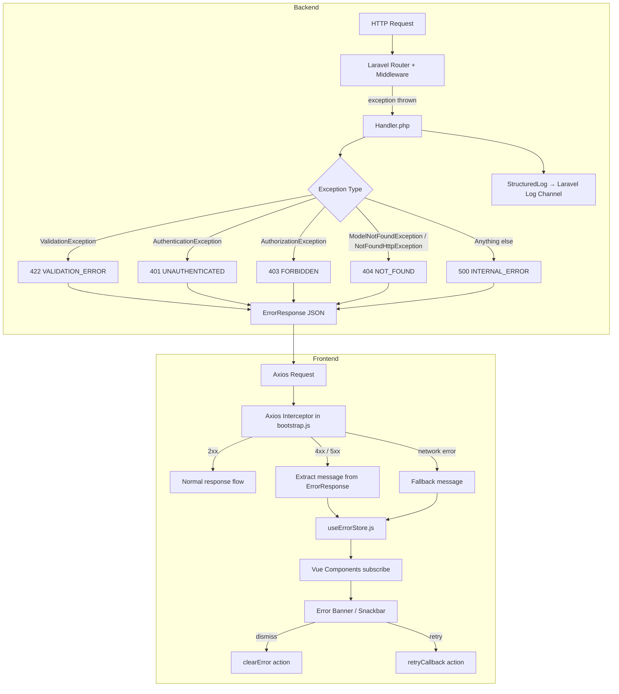

# Design Document: Error Handling

## Overview

This feature adds a centralized, layered error handling system to PUPTAS. The backend Laravel `Handler` normalizes all exceptions into a consistent `ErrorResponse` JSON structure and writes structured logs. The frontend Axios interceptor (registered in `bootstrap.js`) catches all HTTP errors and routes them to a `useErrorStore` composable — following the same module-level reactive pattern as `useSnackbar.js` — so Vue components can display user-friendly messages without any endpoint-specific parsing.

The design deliberately avoids modifying existing business logic. All changes are additive: a new `Handler.php`, a new `useErrorStore.js` composable, and additions to `bootstrap.js`.

---

## Architecture



---

## Components and Interfaces

### Backend: `app/Exceptions/Handler.php`

Extends Laravel's `Illuminate\Foundation\Exceptions\Handler`. Overrides `render()` to intercept all exceptions for HTTP requests and return a normalized `ErrorResponse`.

```php
// Pseudocode — full implementation in tasks
public function render($request, Throwable $e): Response
{
    // 1. Log structured entry
    // 2. Map exception to [statusCode, errorCode, message, extras]
    // 3. Return JSON response
}
```

**Exception mapping table:**

| Exception Class | HTTP Status | errorCode | message |
|---|---|---|---|
| `ValidationException` | 422 | `VALIDATION_ERROR` | validation message + `errors` field |
| `AuthenticationException` | 401 | `UNAUTHENTICATED` | "You are not authenticated. Please log in." |
| `AuthorizationException` | 403 | `FORBIDDEN` | "You do not have permission to perform this action." |
| `ModelNotFoundException` | 404 | `NOT_FOUND` | "The requested resource was not found." |
| `NotFoundHttpException` | 404 | `NOT_FOUND` | "The requested resource was not found." |
| `Throwable` (catch-all) | 500 | `INTERNAL_ERROR` | "Something went wrong. Please try again later." |

**ErrorResponse structure:**

```json
{
  "success": false,
  "message": "Human-readable message",
  "errorCode": "MACHINE_READABLE_CODE",
  "errors": { "field": ["message"] }
}
```

The `errors` field is only present for `VALIDATION_ERROR`. Stack traces, SQL text, and filesystem paths are never included.

### Backend: Structured Logger (private method on Handler)

```php
private function logStructured(Throwable $e, Request $request): void
{
    Log::error('exception', [
        'message'      => $e->getMessage(),
        'exception'    => get_class($e),
        'trace'        => $e->getTraceAsString(),
        'timestamp'    => now()->utc()->toIso8601String(),
        'method'       => $request->method(),
        'endpoint'     => $request->path(),
        'user_id'      => optional(Auth::user())->id,
        'request_data' => $this->sanitize($request->all()),
    ]);
}

private const SENSITIVE_FIELDS = [
    'password', 'password_confirmation', 'token',
    'secret', 'api_key', 'authorization',
];

private function sanitize(array $data): array
{
    // Recursively replace sensitive keys with "[REDACTED]"
}
```

### Frontend: `resources/js/Composables/useErrorStore.js`

Follows the exact same module-level reactive singleton pattern as `useSnackbar.js`.

```js
import { reactive } from 'vue'

const errorState = reactive({
  message: null,      // string | null
  retryCallback: null // function | null
})

export function useErrorStore() {
  const setError = (message, retryCallback = null) => { ... }
  const clearError = () => { ... }
  const retry = () => { ... }
  return { errorState, setError, clearError, retry }
}
```

### Frontend: Axios Interceptor in `bootstrap.js`

Registered once after `window.axios` is set up. Handles response errors and network errors.

```js
window.axios.interceptors.response.use(
  response => response,
  error => {
    const { setError } = useErrorStore()
    if (error.response) {
      const message = error.response.data?.message
        ?? 'An unexpected error occurred. Please try again.'
      setError(message, /* optional retry */)
    } else {
      setError('Unable to connect. Please check your connection and try again.')
    }
    return Promise.reject(error)
  }
)
```

The interceptor always re-rejects so callers can still handle errors locally if needed.

---

## Data Models

### ErrorResponse (PHP array / JSON)

```
{
  success:   false          // always false for errors
  message:   string         // non-empty, user-safe
  errorCode: string         // non-empty, machine-readable
  errors?:   object         // only present for VALIDATION_ERROR
}
```

### StructuredLog (PHP array written via `Log::error`)

```
{
  message:      string       // exception message
  exception:    string       // FQCN of exception class (internal only)
  trace:        string       // full stack trace (internal only)
  timestamp:    string       // ISO 8601 UTC
  method:       string       // HTTP verb
  endpoint:     string       // request path
  user_id:      int|null     // authenticated user ID or null
  request_data: object       // sanitized — sensitive fields replaced with "[REDACTED]"
}
```

### ErrorState (Vue reactive object)

```
{
  message:       string | null    // current error message, null when no error
  retryCallback: function | null  // optional retry action
}
```

---

## Correctness Properties

*A property is a characteristic or behavior that should hold true across all valid executions of a system — essentially, a formal statement about what the system should do. Properties serve as the bridge between human-readable specifications and machine-verifiable correctness guarantees.*

### Property 1: ErrorResponse structural invariant

*For any* exception type thrown during an HTTP request, the Handler SHALL return a response whose JSON body satisfies: `success === false`, `message` is a non-empty string, and `errorCode` is a non-empty string.

**Validates: Requirements 1.2, 1.3, 7.3**

---

### Property 2: Content-Type is always application/json

*For any* exception type thrown during an HTTP request, the Handler SHALL return a response with `Content-Type: application/json`.

**Validates: Requirements 1.6**

---

### Property 3: No internal details in ErrorResponse

*For any* exception (including those whose messages contain SQL text, filesystem paths, or class names), the ErrorResponse body fields SHALL NOT contain stack trace markers, SQL keywords (`SELECT`, `INSERT`, `WHERE`, etc.), or absolute filesystem paths.

**Validates: Requirements 3.6, 4.2**

---

### Property 4: Sensitive field sanitization

*For any* request data containing any subset of the SensitiveFields (`password`, `password_confirmation`, `token`, `secret`, `api_key`, `authorization`), the StructuredLog entry's `request_data` SHALL have every sensitive key replaced with `"[REDACTED]"` while all non-sensitive keys retain their original values.

**Validates: Requirements 2.7, 2.8**

---

### Property 5: Log entry contains request context

*For any* HTTP request that causes an exception, the StructuredLog entry SHALL contain the exception message, the HTTP method, and the endpoint path from that request.

**Validates: Requirements 2.2, 2.5**

---

### Property 6: Interceptor extracts message from any error response

*For any* HTTP 4xx or 5xx response that contains a `message` field in its JSON body, the Axios interceptor SHALL surface exactly that message string (not the raw response object).

**Validates: Requirements 5.2, 5.4**

---

### Property 7: Interceptor uses fallback for unparseable responses

*For any* HTTP error response whose body is missing the `message` field or is not valid JSON, the Axios interceptor SHALL use the fallback message `"An unexpected error occurred. Please try again."`.

**Validates: Requirements 5.3**

---

### Property 8: ErrorStore round-trip

*For any* non-empty error message string, after calling `setError(message)` on the ErrorStore, `errorState.message` SHALL equal that string; after calling `clearError()`, `errorState.message` SHALL be `null`.

**Validates: Requirements 6.1, 6.3**

---

### Property 9: Retry callback invocation

*For any* function `fn`, after calling `setError(message, fn)` on the ErrorStore, calling `retry()` SHALL invoke `fn` exactly once.

**Validates: Requirements 6.4**

---

## Error Handling

### Backend error categories and responses

| Scenario | Status | errorCode | Notes |
|---|---|---|---|
| Validation failure | 422 | `VALIDATION_ERROR` | Includes `errors` field with field-level messages |
| Unauthenticated | 401 | `UNAUTHENTICATED` | Triggered by `AuthenticationException` |
| Unauthorized | 403 | `FORBIDDEN` | Triggered by `AuthorizationException` |
| Resource not found | 404 | `NOT_FOUND` | `ModelNotFoundException`, `NotFoundHttpException` |
| All other exceptions | 500 | `INTERNAL_ERROR` | Generic catch-all |

### Production security

- `APP_DEBUG=false` in production — enforced via `.env`, not in code
- The Handler never reads `APP_DEBUG` to decide what to include in responses; it always returns the safe generic structure
- Exception class names, traces, and SQL are only written to the log channel, never to the response

### Frontend error flow

- The interceptor always re-rejects the promise so individual call sites can still add local handling
- If a component has its own `.catch()`, it takes precedence; the ErrorStore is a fallback display layer
- Network errors (no `error.response`) use a distinct, connection-specific message

---

## Testing Strategy

### Unit tests (PHPUnit)

- One test per exception type mapping (ValidationException → 422, AuthenticationException → 401, etc.)
- Test that the `sanitize()` method redacts all SensitiveFields and preserves non-sensitive fields
- Test that `logStructured()` writes the correct keys (mock `Log` facade)
- Test authenticated vs. unauthenticated `user_id` in log entry

### Property-based tests (PHPUnit + `eris` or `phpunit-data-provider` with generated inputs)

Each property test runs a minimum of 100 iterations.

- **Property 1** — `Feature: error-handling, Property 1: ErrorResponse structural invariant`
  Generate random exception types; assert response shape invariant holds for all.

- **Property 2** — `Feature: error-handling, Property 2: Content-Type is always application/json`
  Generate random exception types; assert `Content-Type: application/json` for all.

- **Property 3** — `Feature: error-handling, Property 3: No internal details in ErrorResponse`
  Generate exceptions with SQL-like and path-like messages; assert response body is clean.

- **Property 4** — `Feature: error-handling, Property 4: Sensitive field sanitization`
  Generate random request data with random subsets of SensitiveFields mixed with non-sensitive fields; assert all sensitive keys are `"[REDACTED]"` and non-sensitive keys are unchanged.

- **Property 5** — `Feature: error-handling, Property 5: Log entry contains request context`
  Generate random HTTP methods and paths; assert log entry contains them.

### Frontend unit tests (Vitest)

- **Property 6** — `Feature: error-handling, Property 6: Interceptor extracts message from any error response`
  Generate random 4xx/5xx status codes and random message strings; assert interceptor surfaces the message.

- **Property 7** — `Feature: error-handling, Property 7: Interceptor uses fallback for unparseable responses`
  Generate malformed/missing response bodies; assert fallback message is used.

- **Property 8** — `Feature: error-handling, Property 8: ErrorStore round-trip`
  Generate random message strings; assert set then clear round-trip.

- **Property 9** — `Feature: error-handling, Property 9: Retry callback invocation`
  Generate random callback functions (mocks); assert retry invokes them exactly once.

- Example test: network error → connection message
- Example test: middleware-rejected route returns JSON ErrorResponse (integration)
