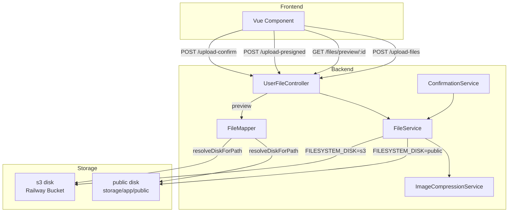

# Design Document: S3 Bucket Migration

## Overview

This design covers migrating PUPTAS file storage from the local `public` disk (`storage/app/public/`) to an S3-compatible backend (Railway Storage Buckets), while maintaining full backward compatibility for files already stored locally.

The core change is introducing a `FileService` abstraction layer that sits between controllers/services and the storage backend. All upload and deletion calls are routed through `FileService`, which delegates to whichever disk is configured via `FILESYSTEM_DISK`. `ImageCompressionService` is decoupled from storage — it processes images and returns raw WebP bytes; `FileService` persists them. File retrieval continues to go through the existing `UserFileController::preview()` signed-route mechanism, ensuring private S3 objects are never exposed via direct URLs.

Railway Storage Buckets are S3-compatible and private by default. All access must be authenticated — either through the backend streaming the file, or via presigned upload URLs for direct client-to-S3 uploads.

## Architecture



**Disk switching** is controlled entirely by the `FILESYSTEM_DISK` environment variable. No code changes are needed to switch backends.

**Backward compatibility** is handled by `FileMapper::resolveDiskForPath()`, which probes disks in priority order to locate a file regardless of which disk was active when it was uploaded.

## Components and Interfaces

### FileService (new)

`App\Services\FileService` — the single entry point for all file storage operations.

```php
interface FileServiceInterface
{
    /**
     * Compress and store an uploaded file on the active disk.
     * Returns ['path' => string, 'original_name' => string].
     */
    public function store(UploadedFile $file, string $directory): array;

    /**
     * Delete a file from whichever disk it resides on.
     * Non-fatal: logs a warning on failure, does not throw.
     */
    public function delete(string $path): void;

    /**
     * Return a Signed_Preview_URL for the given UserFile.
     * Always routes through the backend preview controller.
     */
    public function url(UserFile $file): string;
}
```

**Dependencies injected via constructor:**
- `ImageCompressionService` — handles image processing
- `FileMapper` — used for URL generation and disk resolution

**Active disk resolution:**
```php
private function activeDisk(): string
{
    return config('filesystems.default', 'public');
}
```

### ImageCompressionService (modified)

The `compress()` method is split into two responsibilities:

- **Before (current):** validates → resizes → converts → saves to `Storage::disk('public')`
- **After:** validates → resizes → converts → returns `['webp_data' => string, 'original_name' => string, 'filename' => string]`

A new internal method `processImage(UploadedFile $file): array` handles the image pipeline and returns raw data. `FileService` calls this and then persists the result to the active disk.

The existing `compress()` signature is preserved for backward compatibility but internally delegates to `FileService` when called directly (or is deprecated in favor of `FileService::store()`).

### FileMapper (modified)

`resolveDiskForPath()` probe order updated to: Active_Disk → `public` → `local` → `s3`.

No other changes to `FileMapper`.

### UserFileController (modified)

- `uploadFiles()`: replaces direct `ImageCompressionService::compress()` call with `FileService::store()`
- `preview()`: no logic change — already uses `resolveDiskForPath()` and streams file contents

### ConfirmationService (modified)

- `reuploadFile()`: replaces `$this->compressionService->compress()` + `Storage::disk('public')->delete()` with `FileService::store()` + `FileService::delete()`
- `deleteExistingFile()`: replaces `Storage::disk('public')->delete()` with `FileService::delete()`

### Presigned Upload Endpoint (new, optional)

Two new routes when `FILESYSTEM_DISK=s3`:

| Route | Method | Purpose |
|---|---|---|
| `/upload-presigned` | POST | Generate a presigned S3 upload URL |
| `/upload-confirm` | POST | Confirm upload and create/update `UserFile` |

Controller: `App\Http\Controllers\PresignedUploadController`

## Data Models

No database schema changes are required.

`UserFile.file_path` continues to store only relative paths (e.g., `uploads/files/photo_1234567890_abcd1234.webp`). The disk is never encoded in the path — `FileMapper::resolveDiskForPath()` probes disks at runtime to locate the file.

### Path Format

```
uploads/files/{slug}_{timestamp}_{random}.webp
```

Examples:
- `uploads/files/transcript-of-records_1714000000_a1b2c3d4.webp`  ✅
- `https://bucket.storage.railway.app/uploads/files/...`  ❌
- `/uploads/files/...`  ❌

### FileService::store() Return Shape

```php
[
    'path'          => 'uploads/files/photo_1714000000_abc12345.webp',  // relative, no leading slash
    'original_name' => 'photo.jpg',
]
```

### Presigned Upload Request/Response

**POST /upload-presigned**
```json
// Request
{ "field": "psa", "content_type": "image/jpeg" }

// Response
{
  "upload_url": "https://storage.railway.app/...",
  "path": "uploads/files/psa_1714000000_abc12345.jpg",
  "expires_in": 300
}
```

**POST /upload-confirm**
```json
// Request
{ "field": "psa", "path": "uploads/files/psa_1714000000_abc12345.jpg", "original_name": "psa.jpg" }

// Response
{ "message": "File confirmed", "file": { "url": "...", "mimeType": "...", ... } }
```

## Correctness Properties

*A property is a characteristic or behavior that should hold true across all valid executions of a system — essentially, a formal statement about what the system should do. Properties serve as the bridge between human-readable specifications and machine-verifiable correctness guarantees.*

### Property 1: FileService routes to the configured disk

*For any* valid `UploadedFile` and any `FILESYSTEM_DISK` value in `{public, s3}`, calling `FileService::store()` should persist the file to the disk matching the configured value, and the returned path should begin with `uploads/files/`.

**Validates: Requirements 1.5, 2.4, 2.5**

---

### Property 2: Store then delete removes the file

*For any* file stored via `FileService::store()`, calling `FileService::delete()` with the returned path should result in the file no longer existing on the resolved disk.

**Validates: Requirements 2.2**

---

### Property 3: Stored paths are always relative

*For any* file stored via `FileService::store()`, the `path` value in the returned array and the `UserFile.file_path` value saved to the database should not contain a protocol scheme (`://`), should not start with `/`, and should not contain the bucket name or any disk identifier prefix.

**Validates: Requirements 3.5, 8.1, 8.2, 8.4**

---

### Property 4: Disk resolution returns correct disk for legacy paths

*For any* file path that exists on the `public` (local) disk, `FileMapper::resolveDiskForPath()` should return `'public'` regardless of the current `FILESYSTEM_DISK` setting.

**Validates: Requirements 4.2, 8.3**

---

### Property 5: Disk resolution returns correct disk for migration paths

*For any* file path that exists on the `s3` disk and not on the `public` disk, `FileMapper::resolveDiskForPath()` should return `'s3'`.

**Validates: Requirements 4.3, 8.3**

---

### Property 6: Disk resolution respects probe order

*For any* file path that exists on multiple disks simultaneously, `FileMapper::resolveDiskForPath()` should return the Active_Disk name when the file exists there, regardless of whether it also exists on other disks.

**Validates: Requirements 4.5**

---

### Property 7: File preview streams through backend with no direct S3 URLs

*For any* `UserFile` stored on the `s3` disk, the HTTP response from `UserFileController::preview()` should contain the file's binary contents in the response body, should include a `Content-Type` header matching the file's MIME type, and should not contain a `Location` header or any URL matching the pattern `*.storage.railway.app` or `s3.amazonaws.com` in the response body or headers.

**Validates: Requirements 5.1, 5.2, 7.4**

---

### Property 8: URL generation always returns a signed preview route

*For any* `UserFile` record (regardless of which disk it resides on), `FileMapper::buildPreviewUrl()` and `FileService::url()` should return a string that is a valid Laravel signed URL for the `files.preview` named route, and should not return a direct S3 or public storage URL.

**Validates: Requirements 2.3, 5.3**

---

### Property 9: Presigned upload confirm creates a correct UserFile record

*For any* valid `{ field, path, original_name }` payload sent to `POST /upload-confirm`, the resulting `UserFile` record should have `file_path` equal to the provided `path` (relative, no prefix), `original_name` equal to the provided value, `status` equal to `'pending'`, and the path should match the naming pattern `uploads/files/{slug}_{timestamp}_{random}.{ext}`.

**Validates: Requirements 6.3, 6.5**

---

## Error Handling

| Scenario | Behavior |
|---|---|
| `AWS_ENDPOINT` env var missing | Config exception thrown; error logged with variable name; request aborted |
| S3 `put()` fails | `FileService` throws `\RuntimeException` with S3 error code and attempted path |
| S3 `delete()` fails | `FileService` logs `\Log::warning()` with path and error; does not throw |
| S3 unreachable on upload | Controller catches exception; logs with `user_id`, `file_type`, `disk`, `exception_message`; returns HTTP 503 `'Storage service temporarily unavailable.'` |
| General `FileService` exception | Controller catches; logs full context; returns HTTP 500 `'File operation failed. Please try again.'` |
| File not found on any disk | `UserFileController::preview()` returns HTTP 404 |
| Expired signed preview URL | Laravel signature validation returns HTTP 403 |
| Invalid `content_type` in presigned request | Returns HTTP 422 with validation error |
| S3 error details in response | Stripped — response body never contains bucket name, S3 error codes, or internal paths |

All error responses to the client use generic messages. Internal details are logged server-side only.

## Testing Strategy

### Unit Tests (example-based)

Focus on specific behaviors and delegation contracts:

- `ConfirmationService::reuploadFile()` delegates to `FileService::store()` and `FileService::delete()` (mock `FileService`)
- `UserFileController::uploadFiles()` delegates to `FileService::store()` (mock `FileService`)
- `FileService` throws `\RuntimeException` when S3 `put()` fails (mock S3 disk)
- `FileService` logs warning and does not throw when S3 `delete()` fails (mock S3 disk)
- Controller returns HTTP 500 with generic message when `FileService` throws (mock `FileService`)
- Controller returns HTTP 503 when S3 is unreachable (mock S3 disk)
- `UserFileController::preview()` returns HTTP 404 for non-existent paths
- Expired signed URL returns HTTP 403
- `POST /upload-presigned` with invalid `content_type` returns HTTP 422
- `FileService::url()` never calls `Storage::disk('s3')->temporaryUrl()` (mock S3 disk)

### Property-Based Tests

Using [**Eris**](https://github.com/giorgiosironi/eris) (PHP property-based testing library). Each test runs a minimum of 100 iterations.

| Property | Tag | Generator |
|---|---|---|
| P1: FileService routes to configured disk | `Feature: s3-bucket-migration, Property 1` | Random valid image files × disk values |
| P2: Store then delete removes file | `Feature: s3-bucket-migration, Property 2` | Random valid image files |
| P3: Stored paths are always relative | `Feature: s3-bucket-migration, Property 3` | Random valid image files × directories |
| P4: Disk resolution — legacy paths | `Feature: s3-bucket-migration, Property 4` | Random relative file paths existing on public disk |
| P5: Disk resolution — migration paths | `Feature: s3-bucket-migration, Property 5` | Random relative file paths existing on s3 disk |
| P6: Disk resolution probe order | `Feature: s3-bucket-migration, Property 6` | Random paths existing on multiple disks |
| P7: Preview streams through backend | `Feature: s3-bucket-migration, Property 7` | Random UserFile records on s3 disk |
| P8: URL generation returns signed route | `Feature: s3-bucket-migration, Property 8` | Random UserFile records on any disk |
| P9: Presigned confirm creates correct record | `Feature: s3-bucket-migration, Property 9` | Random valid field/path/original_name combinations |

### Smoke Tests (one-time setup checks)

- S3 disk config uses only env variables (no hardcoded values)
- `use_path_style_endpoint` defaults to `true`
- S3 disk `url` key is unset or points to backend route
- `ImageCompressionService::compress()` does not call `Storage::disk('public')->put()` directly

### Integration Tests

Run against a real or locally-mocked S3-compatible endpoint (e.g., MinIO):

- Upload file → verify object exists in bucket
- Retrieve file via preview route → verify contents match
- Old local files still accessible after migration
- Large file uploads complete without timeout
- No frontend-visible S3 URLs in any API response
